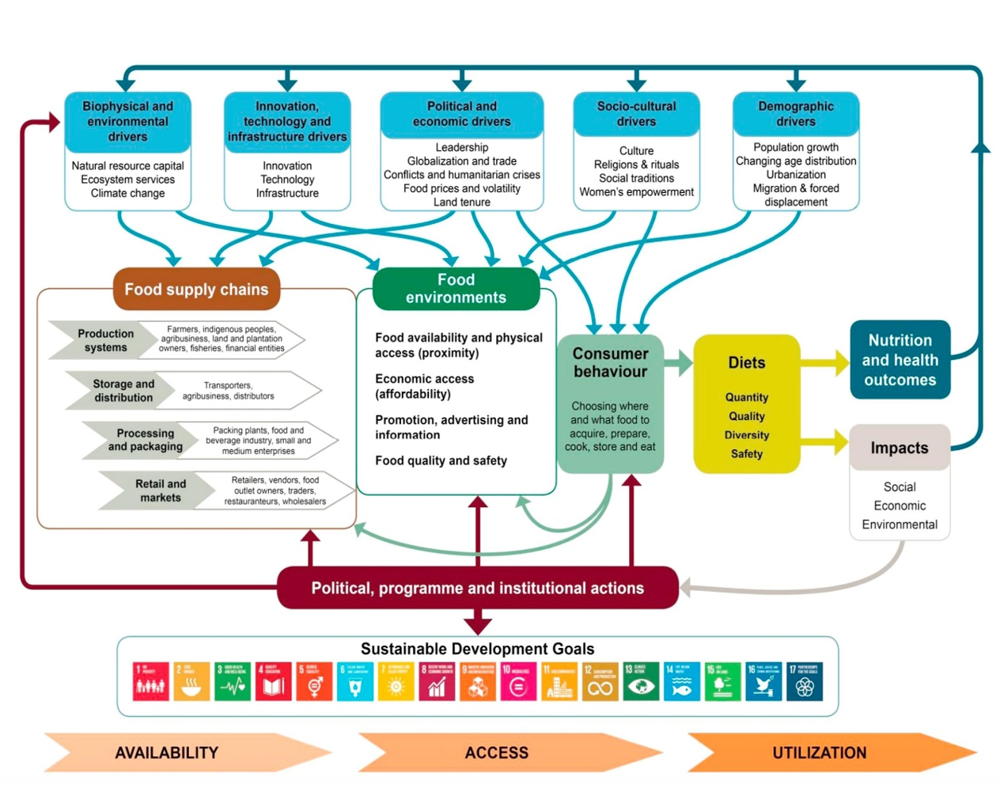
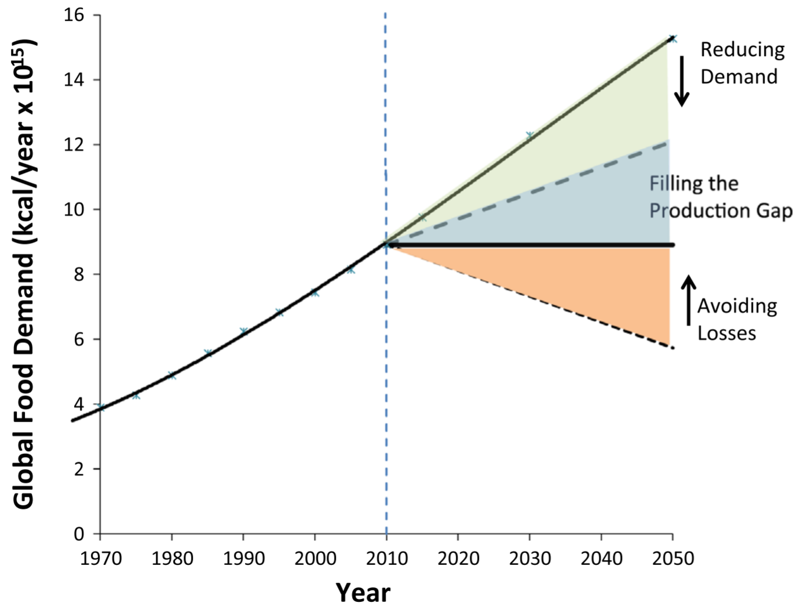
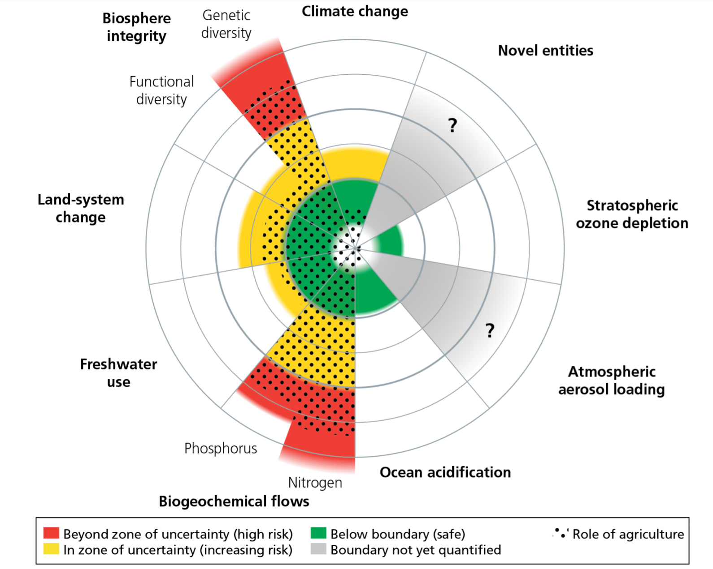

# Plant Based Diets: Food for a Sustainable Future

- [edx](https://www.edx.org/course/plant-based-diets-food-for-a-sustainable-future)
- ⏳ 7 weeks ~ 2–3 hours per week
- 🗓️ Starts `Oct 5`

**Weeks**  
[1. Global Challenges & Systems Thinking](#1-global-challenges--systems-thinking)
2. Food Choices and the Environment
3. Food Choices and Viral Pandemics
4. Food Choices and Chronic Disease
5. Food Choices and Consumer Engagement
6. Proposed Holistic Solution
7. assignment

## 1. Global Challenges & Systems Thinking
### 1.1 Introduction to this Course
Course Creators: Eva Everloo, Ella Stephens

Learning Goals
1. To understand the urgency of addressing the global challenges: climate change, viral pandemics, and chronic diseases.
2. To connect these challenges with our food system and our food choices within the food system particularly.
3. To understand the concept of Systems Thinking in relation to these global challenges.

**Assignment**: Sharing your typical meal
[Sharing your typical meal](paddle)

### 1.2 Three Main Global Challenges
**The State of the World in 2020**: climate challenges, chronic diseases, pandemics

**Sustainable Development Goals and Food & Nutrition**

### 1.3 The Importance of Dietary Patterns
#### **Why Should We Care About What We Eat?**
> “Eat food. Not too much. Mostly plants.” ― Michael Pollan

This course will talk about the role of consumers from high-income countries.
A food system includes all the processes and infrastructure involved in feeding a population.

The conceptual framework below is one of many frameworks used to illustrate the global food system. It illustrates how many actors, interactions, and feedback loops are involved. In this course, we will touch upon various parts of the food system but take a consumer (‘Consumer Behaviour’ and ‘Diets’ in the picture below) perspective. 

[source: Gillespie et al. 2019](https://www.sciencedirect.com/science/article/pii/S0306919218308352)

**How to Feed the Growing Population?**

[source: ScienceDirect](https://www.sciencedirect.com/science/article/abs/pii/S2211912414000327)

The solutions strategies are:
1. **Reduce total demand for food**. This can be done by managing the total population, by lowering the consumption where overconsumption is prevalent, and by changing our resource-intensive dietary patterns.
2. **Filling the production gap**. Conventional agricultural practices need to become more resource efficient, while also ensuring environmental sustainability.  
3. **Avoid food loss and waste**. This includes on-farm, processing, transportation, retail and household waste. The latter one generates the largest portion of all food waste. Food that is wasted should be recycled to recover as much valuable biomass as possible.

With personal dietary choices, individuals can directly contribute to strategies 1 and 3 by reducing the consumption of high-impact foods and by minimizing overconsumption, as well as by avoiding food waste on the consumer-level, respectively.

**The Global Impacts of Our Food System**
Our current food system is not environmentally sustainable. The image below gives a general overview of the planetary boundaries that, due to anthropogenic (human-caused) impact, are already exceeding their safety limits. The planetary boundary model below also represents a set of **environmental indicators** that can be used to assess certain sustainability targets. 

Research shows that our current food system is responsible for around 25% of total greenhouse gas emissions. Besides greenhouse gas emissions, agriculture is the major driver of deforestation. This results in mass-scale biodiversity loss. Agriculture is a main driver to exceeding the world’s nitrogen (N) and phosphorus (P) cycles. Large amounts of nitrogen are required as fertilizers for food and feed production. Also mining rock phosphorus for agricultural fertilizer production is a major cause of the unbalanced P cycle. This in turn leads to global scale eutrophication events. Eutrophication is the excessive growth of plants and algae in a body of water.

By sector, our food system is also the world’s largest water consumer, responsible for more than 90% of the global water footprint.

Alongside the threat of climate change, the global population is also affected by various infectious diseases. An obvious one being the COVID-19 pandemic. Despite effective international political action against the spread of this virus, little attention is raised for the onset, and possible prevention of future zoonotic diseases. Furthermore, the importance of good nutrition in boosting immune function is underreported.

Shockingly, 35% of food-borne illnesses originate from animal-based foods. This makes animal production systems a main driver for viral outbreaks such as SARS in 2003, MERS in 2009, and also the COVID-19 pandemic.

**What Role do We Play in the Food System?**  
Humans and animals are highly dependent on the health of the environmental system they live in.
Suboptimal diet is responsible for more deaths than any other risks globally, including tobacco smoking.
While mitigating and reversing the effects of climate change is a long-term challenge, humans can address the disease risk related to diet now. 
There is a clear association between red and processed meat, and an increased risk of heart disease, cancer, and type 2 diabetes. 

Besides affecting our health, chronic diseases also present a huge economic burden on our society. 

We will focus on consumer change in high income countries such as the United States, Australia, Germany and the Netherlands.

**The Need for a Healthy and Sustainable Diet**  
The FAO states that  sustainable diets are: “diets with a low environmental impact that contribute to food and nutrition security and to healthy life for present and future generations.” 

The EAT Lancet Commission offers guidelines for a global planetary health diet which emphasizes “a plant-forward diet” that includes greater portions of whole grains, fruits, vegetables, nuts, and legumes.

TODO: 1.3.2 Discussion Forum: Brainstorming Solutions

### 1.4 Systems Thinking
Both reductionist and holistic approaches are scientific ways of reasoning used to explain complex problems.

Traditionally, scientific exploration has been led by a reductionist view of how the world works. Reductionism assumes that reality can be explained by the sum of individual components. A limitation of this thinking is that findings cannot always be applied to other systems.

Holism argues that all complex concepts are naturally interconnected:
biologically, chemically, socially, & economically and should be viewed as complete systems. Holistic thinking means that a system is more than the sum of its component parts.
Holism has an all-inclusive nature: it looks at the interaction between the parts and the emergence of new phenomena from the whole.
A limitation is that this also makes it hard to point to one cause of a problem and to test rigorously.
Also, we don’t know what we can’t see - it is virtually impossible to reach a complete understanding of reality.

The best we can do is to reach towards this understanding with the knowledge and tools available nowadays.
Rather than seeing reductionism and holism as an either-or case, both approaches are necessary and can work synergistically.
It is a matter of tipping the scale towards more holistic thinking if we want to find integrated solutions for our global problems that are complexly interconnected.

Let’s look at it this way: healthy people, a healthy economy, and a healthy planet are not alternatives but can be mutually supportive and achievable together.

Complex problems ask for integrated, cross-disciplinary solutions.
This requires systems thinking.
Systems thinking is a holistic approach to problem solving.
With systems thinking, we study the behaviour of an entire system, including the complex relationships between elements rather than focusing on the processes in isolation.
We use models to simulate the behavior of a system.

The founder of Systems Theory, describes a system as a complex of elements that interacts with its environments, that is self-regulating, and that can acquire new properties through emergence.

Every system consists of these 5 parts : 
1. components
2. relationships between components
3. flow
4. boundaries
5. feedback loops
Let’s go through them for our food system.

The doughnut model is a commonly used framework in sustainable development conversations. It helps guide the discussion by considering both planetary and social boundaries.
It is a good example for finding solutions that take more than one perspective into account.

### 1.5 Hope for the Future
Are you familiar with the term eco-anxiety? It is defined by the American Psychological Association as “a chronic fear of environmental doom”.
We are confident that in order to create change at an individual level, we need to generate awareness and spread education towards a conscious awakening.

We propose a holistic approach but realize there are trade-offs to make, as is the case with many solutions.
For example, with regenerative agriculture, less cars, changing our light bulbs, or population control.
What our world needs is momentum from the bottom-up.
Game changers that represent the early adopters of a global transition.

The **Multi-Level Perspective** (MLP), argues that transitions happen through the interactions within and between three analytical levels: niches, regimes, and a broad landscape.
It is a specific interpretation of transition thinking that focuses on complex, long-term, processes
of change at the level of societal needs, such as transportation, nutrition, or energy.
It is a useful model for mapping and discussing transition processes.
For example, the MLP can be applied to agriculture and food systems.

It is time for a new way of looking at food choices, in the context of our food system.
Why? Because food choices are involved as an overlapping driver contributing to the 2020 doom scenarios.
Our world is in need of an interconnected solution instead of continuing with expensive, temporary fixes.

### 1.6 Resources

- 1.2 [Three Main Global Challenges](https://www.scientificamerican.com/article/the-climate-emergency-2020-in-review/)
- [EAT-Lancet Commission Summary Report](https://eatforum.org/eat-lancet-commission/eat-lancet-commission-summary-report/)
