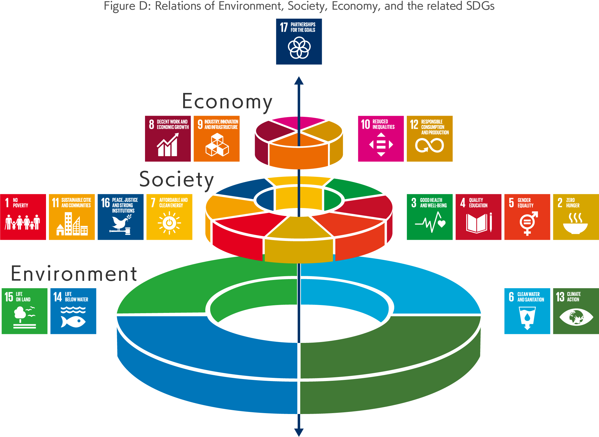
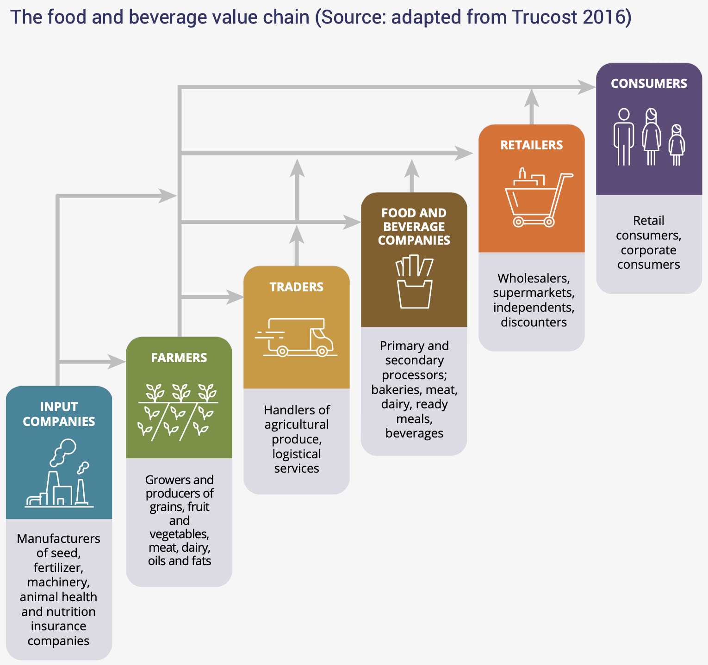

# Scientific and Economic Foundations Report
[link source](http://teebweb.org/our-work/agrifood/reports/scientific-economic-foundations/)

The TEEBAgriFood ‘Scientific and Economic Foundations’ report addresses the core theoretical issues and controversies underpinning the evaluation of the nexus between the agri-food sector, biodiversity and ecosystem services and externalities including human health impacts from agriculture on a global scale. It argues the need for a 'systems thinking' approach, draws out issues related to health, nutrition, equity and livelihoods, presents a Framework for evaluation and describes how it can be applied, and identifies theories and pathways for transformational change.

**Index**  
[1. TEEB for Agriculture & Food](#1-teeb-for-agriculture--food): *background & objectives*  
[2. Systems thinking](#2-systems-thinking): *an approach for understanding eco-agri-food systems*  
3. Eco-agri-food systems: today’s realities and tomorrow’s challenges
4. Human health, diets and nutrition: missing links in eco-agri-food systems
5. Social equity, justice and ethics: missing links in eco-agri-food systems
6. The TEEBAgriFood Framework: towards comprehensive evaluation of eco-agri-food systems
7. TEEBAgriFood methodology: an overview of evaluation and valuation methods and tools
8. Application of the TEEBAgriFood Framework: case studies for decision-makers
9. The TEEBAgriFood theory of change: from information to action
10. TEEBAgriFood and the sustainability landscape: linking to the SDGs and other engagement strategies

- ch8 - Online Annexure: [Background and overview of the ten case studies](http://teebweb.org/wp-content/uploads/2018/06/Online-Annex-Chapter-8-Final-version-1.pdf)

## 1. TEEB for Agriculture & Food
> **background & objectives**

### TEEB: Genesis, Scope, Achievements & Evolution
`The Economics of Ecosystems and Biodiversity` (TEEB) was originally created to help answer the call to make the values of nature more visible so that decision-making and policy outcomes can be informed by a better understanding of our impacts and dependence on the natural world.

TEEB is focused on how we can make the values of nature visible to support a transition to agriculture systems that are truly sustainable and benefit both human and environmental health.

TEEBAgriFood and the Sustainable Development Goals (SDGs)

The delivery on the full range of SDGs is based first on achieving `biospheric` or `ecological` goals (6, 13, 14, 15), it is a necessary but not sufficient condition of achieving `social` goals (1, 10)  and `economic` goals (8) that we have resilient and stable ecosystems. This is reflected in the ‘wedding cake’ structure.
TEEB rests on a central tenet that ecosystems and biodiversity are primary and we must search for incentive mechanisms and achieve the enabling conditions to make them our core concern.

The remit of TEEB was to ‘correct the economic compass’ by presenting appropriate ways of recognizing, demonstrating and then capturing the value of nature. Thus the earlier phase of TEEB considered the entire economy with its many industrial sectors. For an assessment of the eco-agri-food systems complex (as opposed to just the agri-food sector), a comprehensive understanding of all impacts and dependencies across the system, including externalities is required. This is the aim to which TEEBAgriFood seeks to contribute.

### Rationale and Objectives of TEEBAgriFood
The TEEBAgriFood study is designed to:
1. provide a comprehensive economic evaluation of the eco-agri-food systems’ complex, and
2. demonstrate that the economic environment in which farmers operate is distorted by significant externalities, both negative and positive, and a lack of awareness of dependency on natural, social, human and produced capitals.

#### **What is the eco-agri-food systems compex?**
Is when economic, ecological and climatic, and social interface and interact with each other.
Agriculture is an economic sector with a value chain. There are systemic economic interlinkages and economic cross-dependencies in this value chain.

#### **Why is there is a need to examine the externalities of eco-agri-food systems complex?**
what is required by society as a whole -the delivery of sufficient, healthy, nutritious food that does not damage nature.

The current eco-agri-food systems complex impacts both on human health and on the natural environment in detrimental ways; it is now the source of 60% of terrestrial biodiversity loss, 24% of greenhouse gas emissions, 33% of soil degradation and 61% of the depletion of commercial fish stocks. There is an imbalance on consume of calories (800 millon people undernutrition, 1.9 billion people overweight).
One billion of jobs are in small-holder agriculture (less than 2 hectares).

The connections to food systems are clear, especially in terms of some of the identified solutions for a healthier planet - reducing food waste, halting deforestation, using water more efficiently and supporting healthier, lower environmental impact diets.

#### **Why should TEEB be examining the externalities of eco-agri-food systems?**
1. the extent of the positive and negative externalities of the agri-food sector are likely larger than that of any other sector.
2. the approaches applied to date have been inadequate owing in part to the lack of a coherent, universal evaluation framework that includes these disparate externalities along with useful metrics
3. the TEEB community can develop, communicate and operationalize such an evaluation framework; and thereby contribute significantly to the integrity and functioning of ecosystems and to improving human livelihoods.

The top 100 externalities had an estimated cost of around US$4.7 trillion per year in terms of the environmental and social costs of lost ecosystem services and pollution. 11 out of the top 20 externalities were related to agri-food sectors.

In 2014, the Natural Capital Coalition (formerly the TEEB for Business Coalition) launched the Natural Capital Protocol, which provides a framework to help businesses begin to explore their relationship with nature. A food and beverage sector supplement was released in 2016. 
The Protocol highlights from a business perspective the interconnections across agriculture and food systems and the varying degrees of resulting horizontal and vertical integration, underscoring the need to look system-wide to understand how to drive change. 

### Structure of the Report
The aspiration of the TEEBAgriFood project is to change the way that we produce and consume food, so as to reflect the hitherto invisible positive and negative externalities and impacts in the eco-agri-food systems complex. This report – the ‘Scientific and Economic Foundations’ report - focuses on the need to ‘make the case’ for this new paradigm. 

## 2. Systems thinking 
> **an approach for understanding eco-agri-food systems**

